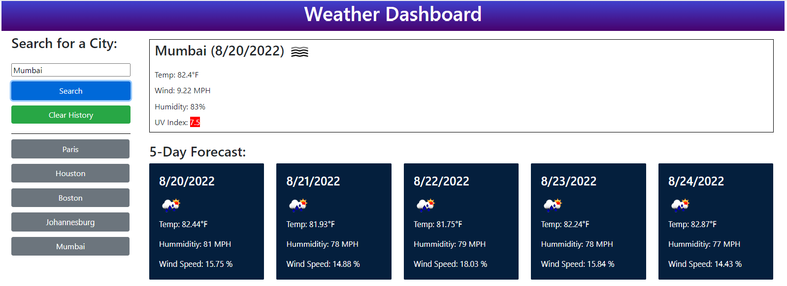

# Weather-Dashboard
## Description
This is a weather app that populates the current weather as well as a five-day forecast for any city in the world that is entered into the search bar. As you enter a city, it is saved and displayed in your search history. You can click any of the cities in your search history list and it will repopulate the weather data for that city. 

## Purpose
The site is for people that want to check the weather in their city or any other city! It is helpful in planning outings, events, trips and etc.

## Built With
- HTML
- CSS
- Javascript
- Moment.js
- jQuery
- Open Weather API

## Demo

### Deployed Link
https://ella9894.github.io/Weather-Dashboard/

## Author
Made by [Gabriella Akpojiyovwi](https://github.com/ella9894/Weather-Dashboard) Inc.